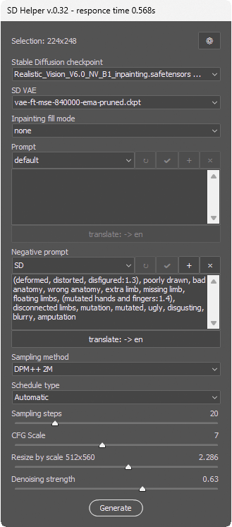
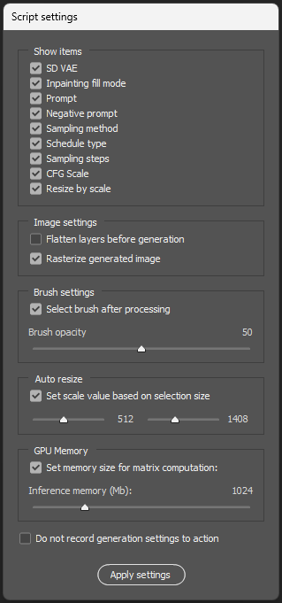

## SD Helper - cкрипт (jsx), предназначенный для отправки выделенного фрагмента изображения в локально установленную Stable Diffusion.

Работает во всех версиях Adobe Photoshop серии Creative Cloud (начиная с CC 2014 (15 версии)) для Windows. Поддерживаются интерфейсы AUTOMATIC1111 и WebUI Forge. Скрипт поддерживает русскую и английскую локализацию (устанавливается автоматически, в зависимости от языка интерфейса Фотошопа).

* [Установка](#Установка)
* [Работа со скриптом](#Работа-со-скриптом)
* [Интерфейс](#Интерфейс)
* [Генерация изображений](#Генерация-изображений)
* [Модуль SD Face restore](#Модуль-для-Adobe-Bridge)
* [Работа по локальной сети](#Модуль-для-Adobe-Bridge)

## Установка

#### Установка Stable Diffusion:

1. Установите [**AUTOMATIC1111**](https://github.com/AUTOMATIC1111) или [**stable-diffusion-webui-forge**](https://github.com/lllyasviel/stable-diffusion-webui-forge). Возможна установка портативных версий или специальных сборок Stable Diffusion из других источников, главное чтобы была возможность включить доступ по API.
2. Скачайте и поместите в папку `models\Stable-diffusion\` любой чекпоинт с которым вы привыкли работать. Для ретуши портретов я использую [**Realistic Vision v5.1**](https://huggingface.co/SG161222/Realistic_Vision_V5.1_noVAE) (учтите, что для некоторых версий может понадобиться установка [VAE](https://huggingface.co/stabilityai/sd-vae-ft-mse-original))
3. Включите доступ по API для установленной Stable Diffusion, добавив ключ `--api` параметры запуска `COMMANDLINE_ARGS` файла `webui-user.bat`
4. Установите [**python**](https://www.python.org/) актуальной верии, в процессе установки активируйте опцию `добавить в PATH`

#### Установка файлов скрипта в Photoshop:

1. Скачайте файлы [SD Helper.jsx](SD%Helper.jsx) и [sd-webui-api v2.pyw](sd-webui-api%v2.pyw), скопируйте их в папку Фотошопа `Presets\Scripts\`
2. Если Фотошоп запущен, перезапустите его. Скрипт появится в меню `Файл->Автоматизация`

## Работа со скриптом

## Интерфейс

Окно скрипта содержит основные параметры Stable Diffusion, необходимые для генерации изображений в режиме img2img.

* `Stable Diffusion checkpoint` - список доступных чекпоинтов, предварительно обученных моделей искусственного интеллекта для генерации изображений
* `SD VAE` - список доступных VAE, энкодеров предназначенных для улучшения качестве генерируемых изображений. При использовании облегченных моделей GGUF список позволяет сделать выбор нескольких энкодеров в соответствии с рекомендациями их авторов.
* `Inpainting fill mode` - переключатель режима inpaint. Если в списке выбрано `none`, то скрипт работает в режиме img2img (генерация изображения, похожего на выделенный фрагмент), если выбран любой из доступных способов заливки, то скрипт работает в режиме inpaint (генерация отдельных деталей внутри существующего изображения)
* `Prompt` - позитивный промпт, текстовая подсказка которой следует нейросеть в процессе генерации. По-умолчанию поле не заполнено. Можно сохранять промпты в виде пресетов, также есть модуль перевода введенного промпта
* `Negative prompt` - негативный промпт, текстовая подсказка, указывающая нейросети чего нужно избегать в процессе генерации. По-умолчанию добавлено два пресета: SD и Realistic рассчитанных на уменьшение деформаций в процессе ретуши. Можно сохранять промпты в виде пресетов, также есть модуль перевода введенного промпта
* `Sampling method` - список доступных сэмплеров, методов преобразования случайного шума в готовое изображение. Напрямую влияет на качество, стиль и скорость генерации.
* `Scheldue type` - список доступных планировщиков, алгоритмов управляющих уровнем шума в процессе генерации
* `Sampling steps` - количество шагов, которые нейросеть делает, пока генерирует изображение
* 'CFG Scale' - регулирование баланса между безусловной и условной генерацией. Чем выше CFG Scale, тем больше нейросеть будет следовать введенным промптам
* 'Resize' - регулировка размера изображения передаваемого неросети. Может быть ручной и автоматической (рассчитывается в соответствии с правилами указанными в настройках скрипта)
* Denoising strength - сила шумоподавления. Определяет, насколько сильно нейросеть будет изменять исходное изображение или в процессе генерации. Влияет на баланс между
  сохранением исходных деталей и созданием новых элементов.

Если у вас установлено несколько чекпоинтов, то скрипт запоминает настройки генерации для каждого.

### Настройки скрипта

* `Show items` - скрипт позволяет включить или отключить видимость отдельных параметров генерации (при этом их настройки запоминаются, скрытие элемента управления предназначено только для упрощения работы с интерфейсом и не означает что скрытый параметр больше не влияет на генерацию)
* `Image settings`
  * * `Flatten layers before generation` - опция определяет склеивать слои перед отправкой выделенного фрагмента изображения на генерацию или нет (при отключенной опции скрипт работает только с содержимым выделенного слоя, игнорируя видимую композицию слоев в документе. При включенной опции документ будет предварительно склеен и на генерацию отправится композитное изображение всех видимых слоев)
  * * `Rasterize generated image` - после окончания генерации скрипт помещает полученный фрагмент на новый слой. Опция определяет будет ли этот слой растеризован или вставлен как смарт-объект
* `Brush settings`- после вставки сгенерированного изображения на новый слой скрипт автоматически создает для него маску слоя. `Select brush after processing` определяет нужно ли автоматически активировать инструмент `brush` после создания маски, а `brush opacity` указывает какую непрозрачность кисти нужно установить
* `Auto resize` - при включении `Set scale value based on selection size`позволяет автоматически подбирать масштаб генерируемого изображения в зависимости от размеров активного выделения
* `Do not record generation settings to action` - опция позволяющая записывать скрипт в экшены в режиме 'bypass'. При отключенной опции в экшен записываются все текущие настройки скрипта, что позволяет хранить их отдельно от основных настроек и использовать при генерации. При включенной опции экшен просто запускает скрипт, его настройки не хранятся в палитре экшенов, вместо этого используются текущие

### Файл настроек

текущие настройки скрипта хранятся в каталоге настроек Фотошопа `%appdata%\Roaming\Adobe\Adobe Photoshop\Adobe Photoshop Settings\SD Helper.desc`

### Панель `Список` предназначена для работы с форматированным текстовым списком.

Скрипт умеет работать с текстовыми данными стандарта CSV - данные располагаются в строках, столбцы отделены друг от друга разделителями. Пустрые строки игнорируются.

Список можно составить непосредственно в окне скрипта при помощи кнопки `Редактировать` (в том числе вставить  данные через буфер обмена из любого офисного приложения или браузера), либо загрузить с диска с помощью кнопки `Открыть`. Открыть можно только TXT или CSV файлы.

После загрузки списка ему можно задать один из двух `режимов отображения` - обычный `список` или `список с заголовками` (первая строка файла считается заголовком таблицы). Также можно задать параметры фильтрации символов в списке включая или выключая соответсвующие опции:

Если загруженный список точно соответствует стандарту CSV, то скрипт сам распознает тип используемых разделителей и в списке `Разделитель слов` можно оставить `авто`. Если данные в списке неструктурированы, то можно вручную указать тип разделителя полей (символ, который отделяет одно поле от другого).

После загрузки списка возможно редактирование отдельных строк - достаточно дважды щелнкуть мышкой по нужной строке.

### Для того, чтобы объяснить скрипту, как на основе содержимого полей списка найти и переименовать файлы, используется панель `Шаблон поиска и переименования файлов`

Принцип составления шаблонов предельно прост - в текстовых полях `поиск` и `переименование` указывается номер поля или интервала полей, которые нужно искать или вставить в новое имя файла. Номер поля можно увидеть в заголовке списка - скрипт добавляет их автоматически при загрузке. Номера полей нужно заключать в квадратные скобки, например `[1]` - первое слово текущей строки, `[2-3]` - второе и третье слово и т.п. Если для текущей строки слово не найдено - шаблон возвращает пустое значение. Для удобства все основные шаблоны подстановки продублированы кнопками - помимо вставки слова `[N]`, интервала `[N-N]` есть возможность вставить имя найденного файла `[F]`, имя папки в которой этот файл найден `[P]`, заголовок поля из которого было найдено имя файла `[H]` (шаблоны `[F],[P],[H]` предназначены только для строки переименования, в строке поиска они игнорируются).

Помимо шаблонов подстановки в строках поиска и переименования можно писать любой текст - в частности, поддерживается создание подкаталогов (для этого в строке переименования нужно указать символ-разделитель пути, например `JPG/[F] [1-2]` в строке переименования означает что в случае удачного поиска файла, в папке назначения будет создан каталог `JPG`, куда будет помещен переименованный по шаблону `[F] [1-2]` файл (т.е. имя исходного файла, пробел первое и второе слово из текущей строки).

> **Обратите внимание, шаблон `интервал` для полей `поиск` и `переименование` работает по-разному.**

В строке `переименование` он просто вставляет указанные слова (например, `[1-2]` - это первое и второе слово из текущей строки списка, `[1-]` с первого слова и до конца строки, `[-3]` - от начала строки и до третьего слова и т.п.), а в строке `поиск` он указывает диапазон отдельных полей для поиска. Т.е. если в строке `поиск` указать [1-2], то скрипт будет искать сначала файлы содержащие в имени слово `[1]`, а затем файлы в имени слово `[2]`, то есть фактически это будет два отдельных поисковых запроса. Например, если в списке есть строка `Петров Петя 060 052 035`, то указав в строке поиска интервал `[3-5]`, мы найдем три разных файла (содержащих 060, 052, 035 в имени соответственно). При поиске скрипт находит все файлы, содержащие символы из шаблона, но выбирает из них только один - тот, имя которого меньше всего отличается от текста указаного в строке `поиск`. Чтобы работа скрипта была более предсказуемой, лучше создавать шаблоны поиска как можно более полно соответствующие именам файлов.

Панель `Шаблон поиска и переименования файлов`также позволяет сохранять настройки шаблонов в виде пресетов.

### При нажатии кнопки `Поиск` осуществляется последовательная обработка всех полей списка и поиск по указанному шаблону файлов из указанной папки.

В результате поиска выводятся два списка - список файлов готовых к переименованию (в формате “найденный файл” -> “новое имя файла”) и список строк, для которых не удалось обнаружить соответствие.

В процессе поиска проверяется уникальность имени каждого файла - если в результате поиска у переименованных файлов будут одинаковые имена, то они автоматически переименуются.

Панель `Назначение файлов` позволяет указать куда копировать или переместить (при включенной опции удалить `найденные файлы из папки источника после копирования`) найденные файлы.

Опция `сохранять исходное имя в метаданных файла` позволяет сохранить исходное имя файла в поле `PreservedFileName`и впоследствии [восстановить его](https://github.com/boogalooper/Snippets/blob/master/Bridge/Bridge%20-%20get%20back%20preserved%20filenames.jsx).

Опция `создавать копии исходного файла при повторах имен файлов в результатах поиска` отвечает за логику работы с дубликатами файлов (когда на один и тот же файл ссылаются несколько полей из списка). Если опция включена - то скрипт создает и переименовывает копии исходного файла по количеству его упоминаний в списке. Если отключена - создается только одна копия, а в имени файла через запятую указываются имена всех копий.

## Модуль для Adobe Bridge

С помощью дополнительного модуля после установки в Фотошоп скрипт может быть вызыван из Бриджа (запускает скрипт, передает путь к папке открытой или выбранной в бридж). Для этого нужно скопировать файл [File collector for Bridge.jsx](File%20collector%20for%20Bridge.jsx)

В Windows:
`C:\Program Files\Common Files\Adobe\Startup Scripts CC\Adobe Photoshop`

в macOs:
`/Users/yourUser/Library/Application Support/Adobe/Bridge CC/Startup Scripts`

Также в обоих системах допустим такой вариант:

`BridgeFolder/Scripts/Startup Scripts`

`BridgeFolder/Startup Scripts`

