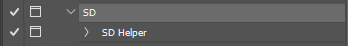
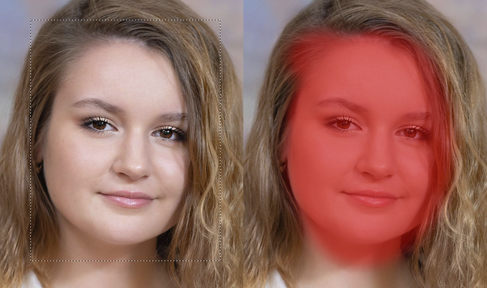
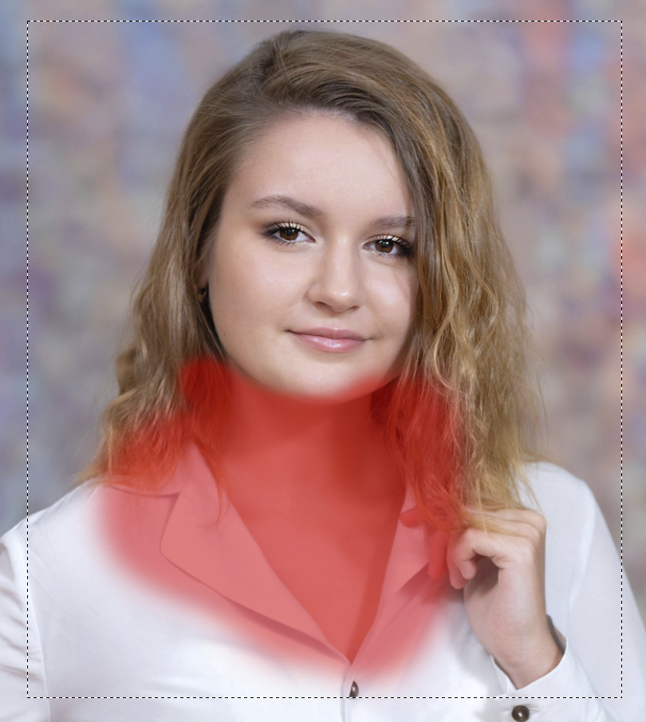
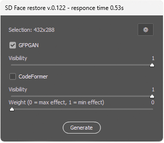

## SD Helper - cкрипт (jsx), который позволяет обрабатывать выделенные фрагменты изображения с помощью Stable Diffusion напрямую из Photoshop. Поддерживаются режимы `img2img`, `inpaint`, а также улучшение лиц с помощью GFPGAN/CodeFormer.

Работает во всех версиях Adobe Photoshop для Windows начиная с CC 2014 (15 версии) Поддерживаются интерфейсы AUTOMATIC1111 и WebUI Forge. Скрипт поддерживает русскую и английскую локализацию (устанавливается автоматически, в зависимости от языка интерфейса Photoshop).

* [Установка](#Установка)
* [Как пользоваться скриптом](#Как-пользоваться-скриптом)
* [Интерфейс](#Интерфейс)
* [Модуль SD Face restore](#Модуль-SD-Face-restore)
* [Работа по сети](#Работа-по-сети)

## Установка

#### Установка Stable Diffusion:

1. Установите [**AUTOMATIC1111 WebUI**](https://github.com/AUTOMATIC1111) или [**Forge**](https://github.com/lllyasviel/stable-diffusion-webui-forge)
2. Скачайте модель (checkpoint) и поместите в папку `models\Stable-diffusion\`. Рекомендуемый вариант [**Realistic Vision v5.1**](https://huggingface.co/SG161222/Realistic_Vision_V5.1_noVAE) (учтите, что для некоторых версий может понадобиться установка [VAE](https://huggingface.co/stabilityai/sd-vae-ft-mse-original))
3. Включите доступ по API для установленной Stable Diffusion, добавив ключ `--api` параметры запуска `COMMANDLINE_ARGS` файла `webui-user.bat`
```
set COMMANDLINE_ARGS=--api
```
4. Установите [**python**](https://www.python.org/) актуальной верии, в процессе установки активируйте опцию `добавить в PATH`

#### Установка файлов скрипта в Photoshop:

1. Скачайте файлы:
    * [SD Helper.jsx](SD%20Helper.jsx) 
    * [sd-webui-api v2.pyw](sd-webui-api%20v2.pyw)

2. Скопируйте их в папку Presets\Scripts\ вашего Photoshop.
3. Если Photoshop запущен, перезапустите его. Скрипт появится в меню `File->Sсripts`

## Как пользоваться скриптом

> ### ⚠️ Перед началом работы со скриптом запустите локально установленную версию Stable Diffusion и дождитесь её полной загрузки

### Особенности запуска скрипта

#### Скрипт работает в двух режимах:

* Диалоговый режим — открывает окно настроек перед генерацией (по умолчанию).

* Тихий режим — использует сохранённые параметры, не показывая интерфейс.

Диалоговый режим активируется при первом запуске скрипта (в том числе после перезапуска Фотошопа), а также в случае возникновения ошибки в процессе генерации. Все последующие запуски осуществляются в тихом режиме. 

#### Для запуска скрипта в режиме диалогого окна в любой момент времени, можно:

* удерживать `Shift` при запуске скрипта из меню Photoshop `File → Scripts → SD Helper`
* записать скрипт в экшен и активирать значок запуска с диалогом

  

* использовать вспомогательный сценарий Windows [SD API forwarding.vbs](SD%20API%20forwarding.vbs). Передайте `любой` аргумент в командной строке чтобы открыть диалог.


## Основные режимы

### img2img

* выделите область на изображении (поддерживается быстрая маска)



* Запустите скрипт
* Настройте параметры и нажмите `Generate`
* Результат генерации появится на отдельном слое

### inpaint

В этом режиме необходимо разделить область генерации и изображение которое будет передано в Stable Diffusion.

* Включите быструю маску, закрасьте область, в которой хотите внести изменения

* Не выходя из быстрой маски, создайте выделение — это будет область, переданная в Stable Diffusion



* Запустите скрипт, настройте параметры генерации (не забудьте указать один из доступных режимов `Inpainting fill mode`) и нажмите `Generate`
* Результат генерации появится на отдельном слое

## Интерфейс

Окно скрипта позволяет настроить параметры генерации в режиме img2img и inpaint


* `Stable Diffusion checkpoint` - выбор модели генерации
* `SD VAE` -  выбор энкодера VAE (улучшает цвет и детализацию). При использовании облегченных моделей GGUF список позволяет сделать выбор нескольких энкодеров
* `Inpainting fill mode` - переключатель режима inpaint. Если в списке выбрано `none`, то скрипт работает в режиме img2img, если выбран любой из доступных вариантов заливки, то скрипт работает в режиме inpaint
* `Prompt` - позитивный промпт, текстовая подсказка которой следует нейросеть в процессе генерации. По-умолчанию поле не заполнено. Можно сохранять промпты в виде пресетов, также есть модуль перевода введенного промпта
* `Negative prompt` - негативный промпт, текстовая подсказка, указывающая нейросети чего нужно избегать в процессе генерации. По-умолчанию добавлено два пресета: SD и Realistic рассчитанных на уменьшение деформаций в процессе ретуши. Можно сохранять промпты в виде пресетов, также есть модуль перевода введенного промпта
* `Sampling method` - список доступных сэмплеров, методов преобразования случайного шума в готовое изображение. Напрямую влияет на качество, стиль и скорость генерации.
* `Scheldue type` - список доступных планировщиков, алгоритмов управляющих уровнем шума в процессе генерации
* `Sampling steps` - количество шагов, которые нейросеть делает, пока генерирует изображение
* `CFG Scale` - регулирование баланса между безусловной и условной генерацией. Чем выше CFG Scale, тем больше нейросеть будет следовать введенным промптам
* `Resize` - регулировка размера изображения передаваемого неросети. Может быть ручной и автоматической (рассчитывается в соответствии с правилами указанными в настройках скрипта)
* `Denoising strength` - сила шумоподавления. Определяет, насколько сильно нейросеть будет изменять исходное изображение или в процессе генерации. Влияет на баланс между сохранением исходных деталей и созданием новых элементов.

Если у вас установлено несколько чекпоинтов, то скрипт запоминает настройки генерации для каждого.

### Настройки скрипта


* `Show items` - скрипт позволяет включить или отключить видимость отдельных параметров генерации (при этом их настройки запоминаются, скрытие элемента управления предназначено только для упрощения работы с интерфейсом и не означает что скрытый параметр больше не влияет на генерацию)
* `Image settings`
  * * `Flatten layers before generation` - опция определяет склеивать слои перед отправкой выделенного фрагмента изображения на генерацию или нет (при отключенной опции скрипт работает только с содержимым выделенного слоя, игнорируя видимую композицию слоев в документе. При включенной опции документ будет предварительно склеен и на генерацию отправится композитное изображение всех видимых слоев)
  * * `Rasterize generated image` - после окончания генерации скрипт помещает полученный фрагмент на новый слой. Опция определяет будет ли этот слой растеризован или вставлен как смарт-объект
* `Brush settings`- после вставки сгенерированного изображения на новый слой скрипт автоматически создает для него маску слоя. `Select brush after processing` определяет нужно ли автоматически активировать инструмент `brush` после создания маски, а `brush opacity` указывает какую непрозрачность кисти нужно установить
* `Auto resize` - при включении `Set scale value based on selection size`позволяет автоматически подбирать масштаб генерируемого изображения в зависимости от размеров активного выделения
* `Set memory size for matrix computation` - опция позволяет управлять размером памяти, выделяемом для расчета матриц преобразования (вся остальная память GPU используется непосредственно для загрузки модели)
* `Do not record generation settings to action` - опция позволяющая записывать скрипт в экшены в режиме 'bypass'. При отключенной опции в экшен записываются все текущие настройки скрипта, что позволяет хранить их отдельно от основных настроек и использовать при генерации. При включенной опции экшен просто запускает скрипт, его настройки не хранятся в палитре экшенов, вместо этого используются текущие

### Файл настроек

текущие настройки скрипта хранятся в каталоге настроек Фотошопа `%appdata%\Roaming\Adobe\Adobe Photoshop\Adobe Photoshop Settings\SD Helper.desc`

## Модуль SD Face restore

Модуль [SD Face restore.jsx](SD%20Face%20restore.jsx) предназначен для запуска алгоритмов улучшения лиц GFPGAN и CodeFormer. Принцип работы и запуска скрипта аналогичен `SD Helper`



Для запуска в режиме диалогового окна можно использовать файл сценария [SD face restore.vbs](SD%20face%20restore.vbs)

## Работа по сети

`SD Hepler` и `SD Face restore` поддерживают работу по сети. Для доступа к Stable Diffusion запущенном на удаленном компьютере необходимо открыть код соответсвующего скрипта и указать адрес сетевого устройства на котором запущена Stable Diffusion в константе `SD_HOST`. При необходимости можно указать порт в константе `SD_PORT`. Управление очередью задач осуществляется встроенным планировщиком Stable Diffusion.

